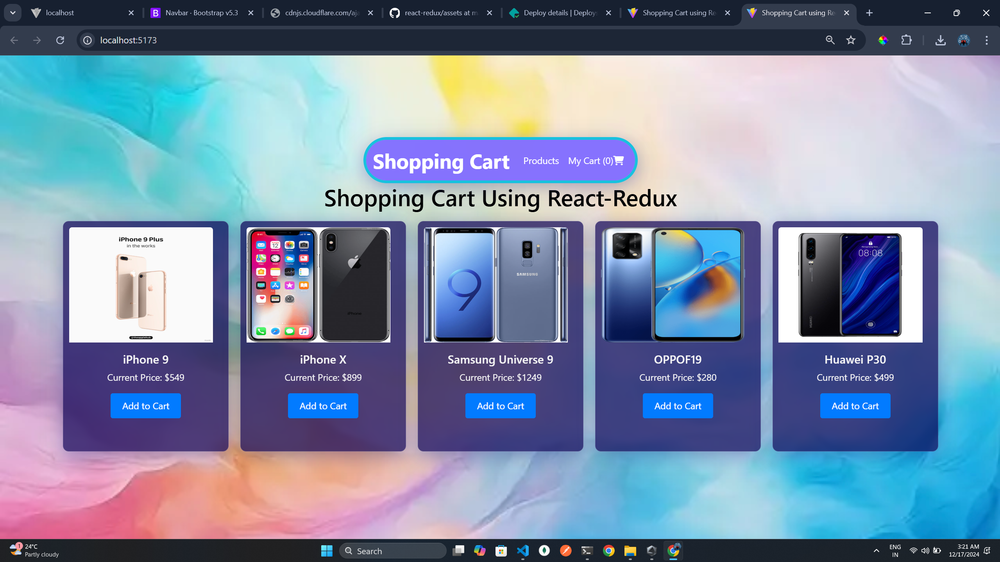
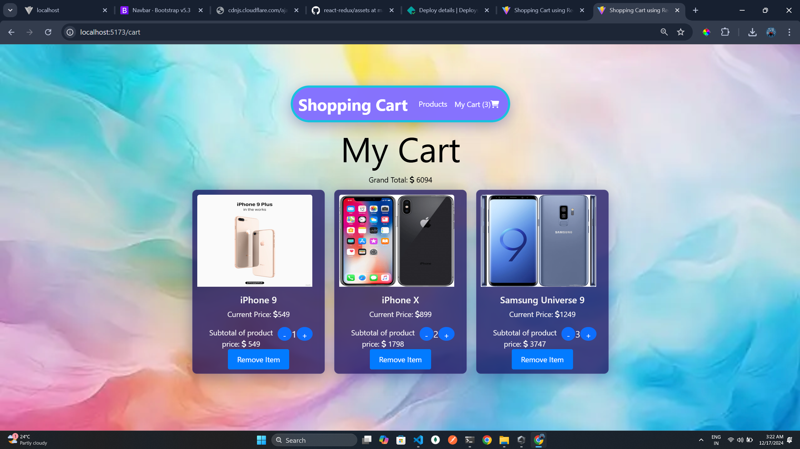

# Shopping Cart using Redux

This is a simple **Shopping Cart application** built with **React**, **Redux**, and **Bootstrap**. The application allows users to add products to their cart, view the cart, modify product quantities, and remove items. It uses **Redux** for state management and **React Router** for page navigation.

## Features

- **Add products** to the shopping cart.
- **View product details** with the price, and adjust quantities.
- **Remove items** from the cart.
- **Dynamic cart updates** reflecting real-time changes in the cart total.
- **Responsive design** using Bootstrap, ensuring the app works seamlessly across different screen sizes.

## Technologies Used

- **React**: A JavaScript library for building user interfaces.
- **Redux**: A state management library to manage the cart state.
- **React Router**: To handle navigation between pages (Home and Cart).
- **Bootstrap**: A front-end framework to create responsive layouts and components.
- **FontAwesome**: For icons used in the cart.

## Deployed Link https://reactreduxbybharath.netlify.app/

## Application Preview 

 